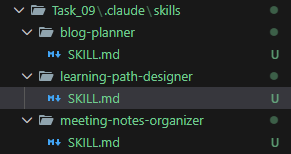

# 🧩 Claude CLI Skill Feature 

Claude CLI **Skills** are small YAML configuration files that extend how the AI behaves for specific tasks.  
Each skill acts like a focused “mini-agent” with its own purpose, rules, and workflows.

---

## ⭐ What Are Skills?

Skills tell Claude **how to behave** in certain situations.  
When a user’s request matches a skill’s purpose, Claude automatically activates that skill.

---

## ✅ What Skills Can Do

- Add custom behaviors for writing, coding, or planning  
- Run automatically when relevant  
- Combine multiple skills in one conversation  
- Make the AI consistent across projects  
- Automate repetitive tasks  

## 📁 Skill File Example

name: "blog-planner"
description: "Helps plan blog posts, outlines, titles, and introductions."
version: "1.0.0"

## 🔧 How to Add a Skill in Claude CLI

Claude CLI allows you to extend its behavior using **Skills** — YAML files that define custom AI workflows.  
Adding a skill is simple and automatic once placed in the right folder.

---

### ✅ Step 1 — Create a Skill File

Create a new `.md` file (for example: `blog-planner/SKILL.md`) and define your skill:

name: "blog-planner"
description: "Helps plan blog posts, outlines, titles, and introductions."
version: "1.0.0"

### ✅ Step 2 — Place the File in the Skills Folder

Move your skill file to the Claude skills directory:

Windows:
C:\Users\<your-username>\.claude\skills\

## Here is the File Structure 

